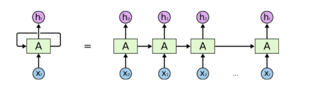
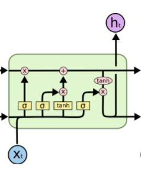

Traditional Neural Networks fails to generalize well for sequence data. Recurrent Neural Networks are a type of neural networks that have loop within them and works well with sequence data.

 
<strong>An unrolled RNN structure</strong>

But the Recurrent Neural Networks works well for problems with short term dependencies. For example we want to predict the next word in the sentence "i drank apple ____" RNNs work well in this context but fail to generalize the words in a sentence that has long term dependencies like "the cat, which already ate...*was* full" and "the cats, which already ate...*were* full"
LSTM's works really good for long term dependencies. In Standard RNN's, the repeating module have very simple structure usually a single "tanh" layer whereas LSTM's have four neural network layers interacting in a very special way. The key to LSTM's is the memory cell state, horizontal line running on top of the diagram.

 
<strong>Single LSTM Unit</strong>

LSTM's have ability to add or remove information to the cell state, carefully regulated by structures called gates.
The first sigmoid layer outputs numbers between 0 and 1, describing how much of each component should be let through. "0" means "let nothing through" and "1" mean "let everything through".
for example, if we would like to forget the gender of the old subject and update to new gender of another subject. The first sigmoid layer looks at "previous cell activation" and "input at the current time step" and outputs a value between 0 and 1. In order to update it involves two steps: first a sigmoid layer called input gate layer decides which values we will update and next "tanh" layer creates vector of candidate values that could be added to state. In next step, we will combine these two and create and update to the state. Next, we need to output. The output will be based on our cell state but filtered version. First we run a sigmoid layer that decides which parts of the cell state we are going to output. Then, we put the cell state through 'tanh' to push the cell state values between (-1,1) and multiply it by the output of the sigmoid gate, so that we only output the parts we decided to.
